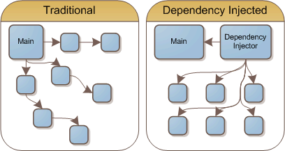

# Chapter 1

## 디자인 패턴과 프로그래밍 패러다임

### 1.1 디자인 패턴

디자인 패턴이란 프로그램을 설계할 때 발생했던 문제점들을 객체 간의 상호 관계 등을 이용하여 해결할 수 있도록 하나의 '규약' 형태로 만들어 놓은 것을 의미한다.

#### 싱글톤 패턴

싱글톤 패턴(singleton pattern)은 하나의 클래스에 오직 하나의 인스턴스만 가지는 패턴이다. 보통 데이터베이스 연결 모듈에 많이 사용한다.

하나의 인스턴스를 만들어 놓고 해당 인스턴스를 다른 모듈들이 공유하며 사용하기 때문에 인스턴스를 생성할 때 드는 비용이 줄어드는 장점이 있다. 하지만 의존점이 높아진다는 단점을 가지고 있다.

#### 자바스크립트의 싱글톤 패턴

```javascript
const obj = {
  a: 27
};

const obj2 = {
  a: 27
};

console.log(obj === obj2); // false
```

자바스크립트에서는 리터럴 {} 또는 new Object로 객체를 생성하게 되면 다른 어떤 객체와도 같지 않기 때문에 이 자체만으로 싱글톤 패턴을 구현할 수 있다.

```javascript
class Singleton {
  constructor() {
    if (!Singleton.instance) {
      Singleton.instance = this;
    }
    return Singleton.instance;
  }
  getInstance() {
    return this.instance;
  }
}

const a = new Singleton();
const b = new Singleton();

console.log(a === b); // true
```

위의 코드는 Singleton.instance라는 하나의 인스턴스를 가지는 Singleton 클래스를 구현한 코드다. a와 b는 하나의 인스턴스를 가진다.

#### 데이터베이스 연결 모듈

앞서 말했듯 싱글톤 패턴은 데이터베이스 연결 모듈에 많이 쓰인다.

```javascript
const URL = 'mongodb://localhost:27017/kundolapp';
const createConnection = url => ({ url: url });

class DB {
  constructor(url) {
    if (!DB.instance) {
      DB.instance = createConnection(url);
    }
    return DB.instance;
  }
  connect() {
    return this.instance;
  }
}

const a = new DB(URL);
const b = new DB(URL);

console.log(a === b); // true
```

이렇게 DB.instance라는 하나의 인스턴스를 기반으로 a, b를 생성하는 것을 볼 수 있다. 이를 통해 데이터베이스 연결에 관한 인스턴스 생성 비용을 아낄 수 있다.

실제로 싱글톤 패턴은 Node.js에서 Mongo DB 데이터베이스를 연결할 때 쓰는 mongoose 모듈에서 볼 수 있으며, MySQL 데이터베이스를 연결할 때도 싱글톤 패턴이 쓰인다.

#### 싱글톤 패턴의 단점

싱글톤 패턴은 TDD(Test Driven Development)를 할 때 걸림돌이 된다. TDD를 할 때 단위 테스트를 주로 하는데, 단위 테스트는 테스트가 서로 독립적이어야 하며 테스트를 어떤 순서로든 실행할 수 있어야 한다.

하지만 싱글톤 패턴은 미리 생성된 하나의 인스턴스를 기반으로 구현하는 패턴이므로 각 테스트 마다 '독립적인' 인스턴스를 만들기가 어렵다.

#### 의존성 주입

싱글톤 패턴은 사용하기 쉽고, 실용적이지만 모듈 간의 결합을 강하게 만들 수 있다는 단점이 있다. 이 때 의존성 주입(DI, Dependency Injection)을 통해 모듈 간의 결합을 조금 더 느슨하게 만들어 해결할 수 있다.

> 의존성 : 종속성이라고도 하며, A가 B에 의존성이 있다는 것은 B의 변경 사항에 대해 A 또한 변해야 된다는 것을 의미한다.

<br />

<p align="center" >
  
</p>

위 그림처럼 메인 모듈(main module)이 **직접** 다른 하위 모듈에 대한 의존성을 주기보다는 중간에 dependecy injector이 이 부분을 가로채 메인 모듈이 **간접**적으로 의존성을 주입하는 방식이다.

이를 통해 메인 모듈은 하위 모듈에 대한 의존성이 떨어지게 된다. 참고로 이를 '디커플링이 된다'고도 한다.

**의존성 주입의 장점**

- 모듈들을 쉽게 교체할 수 있는 구조가 되어 테스팅하기 쉽고 마이그레이션하기도 수월하다.
- 애플리케이션을 쉽게 추론할 수 있으며, 모듈 간의 관계들이 좀 더 명확해진다.

**의존성 주입의 단점**

- 모듈들이 더욱 더 분리되므로 클래스 수가 늘어나 복잡성이 증가될 수 있으며 약간의 런타임 페널티가 생기기도 한다.

**의존성 주입 원칙**

의존성 주입은 다음과 같은 의존성 주입 원칙을 지키며 만들어야한다.

- 상위 모듈은 하위 모듈에서 어떠한 것도 가져오지 않아야 한다. 둘 다 추상화에 의존해야 하며, 이 때 추상화는 세부 사항에 의존하지 말아야한다.
