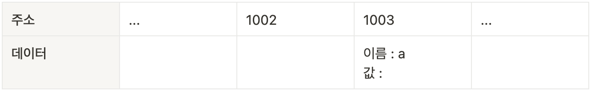

# 코어 자바스크립트 🐯

## 🔧 데이터 타입

### 1. 데이터 타입의 종류

자바스크립트의 데이터 타입은 크게 기본형(원시형, primitive type)과 참조형(referance type)으로 나뉩니다.

기본형에는 숫자(number), 문자열(string), 불리언(boolean), null, undefined 등이 있으며, ES6에서 심볼(symbol)이 추가됐습니다.
참조형에는 객체(object)가 있고, 배열(array), 함수(function), 날짜(Date), 정규표현식(RegExp) 등과 ES6에서 추가된 Map, WeakMap, Set, WeakSet 등이 객체의 하위 분류에 속합니다.

그런데 어떤 기준으로 기본형과 참조형을 분류하는 것일까요? 일반적으로 기본형은 할당이나 연산 시 복제되고 참조형은 참조된다고 알려져 있습니다. 엄밀히 말하면 둘 모두 복제를 하긴 합니다. 다만 기본형은 값이 담긴 주소값을 바로 복제하는 반면, 참조형은 주솟값으로 이루어진 묶음을 가리키는 주소값을 복제하는 점이 다릅니다.

### 2. 데이터 타입에 관한 배경지식

#### 1-2-1 메모리와 데이터

0 또는 1만 표현할 수 있는 하나의 메모리 조각을 비트(bit)라고 합니다. 메모리는 매우 많은 비트들로 구성되어 있는데, 각 비트는 고유한 식별자(unique identifier)를 통해 위치를 확인 할 수 있습니다. 그런데 고작 0이나 1만 표현할 수 있는 비트 단위로 위치를 확인하는 것은 매우 비효율적입니다. 그보다는 몇 개씩 묶어 하나의 단위로 여긴다면 표현할 수 있는 값도 늘어나면서 동시에 검색 시간을 줄일 수도 있을 겁니다.

한편 매우 많은 비트를 한 단위로 묶으면 이번에는 검색 시간을 줄일 수도 있고 표현할 수도 있는 데이터의 개수도 늘어나겠지만 동시에 낭비되는 비트가 생기기도 합니다. 자주 사용하지 않을 데이터를 표현하기 위해 빈 공간을 남겨놓기보다는 표현 가능한 개수에 어느정도 제약이 따르더라도 크게 문제가 되지 않을 적정한 공간을 묶는 편이 낫습니다. 이런 고민의 결과로 바이트(byte)라는 단위가 생겼습니다.

c/c++, java와 같은 정적 타입 언어는 메모리의 낭비를 최소화하기 위해 데이터 타입별로 할당할 메모리 영역을 2바이트, 4바이트 등으로 나누어 정해 놓았습니다. 예를 들어, 2바이트 크기의 정수형 타입(short)은 0을 포함해 -32768 ~ +32767의 숫자만 허용합니다. 만약 사용자가 +32768 또는 그 이상의 숫자를 입력하면 오류가 나거나 잘못된 값이 저장되고 맙니다. 이 문제를 해결하기 위해서는 사용자가 직접 4바이트 크기의 정수형 타입(int) 등으로 형변환 해야합니다.

한편 메모리 용량이 과거보다 월등히 커진 상황에서 등장한 자바스크립는 상대적으로 메모리 관리에 대한 압박에서 자유로워졌습니다. 그래서 메모리 공간을 좀 더 넉넉하게 할당했습니다. 숫자의 경우 정수형인지 부동소수형인지를 구분하지 않고 64비트, 즉 8바이트를 확보합니다. 덕분에 개발자가 위와 같은 형변환을 걱정 해야하는 상황이 훨씬 덜 발생하게 되었습니다.

우리는 지금 컴퓨터에서 숫자형 데이터를 저장하는 방법을 개념적으로 알아보고 있습니다. 앞서 각 비트는 고유한 식별자를 지닌다고 했었죠. 바이트 역시 시작하는 비트의 식별자로 위치를 파악할 수 있을 것입니다. 모든 데이터는 바이트 단위의 식별자, 더 정확하게는 **메모리 주솟값**을 통해 서로 구분하고 연결할 수 있습니다.

#### 1-2-2 식별자와 변수

**변수**는 '변할 수 있는 수'입니다. 영어단어 variable은 원래 '변할 수 있다'라는 형용사이지만 컴퓨터 용어로 쓸 때는 '**변할 수 있는 무언가**'라는 명사로 확장시켰습니다. 여기서 무언가란 **데이터**를 말합니다. 숫자도 데이터이고, 문자열, 객체, 배열 모두 데이터입니다. **식별자**는 어떤 데이터를 식별하는 데 사용하는 이름, 즉 **변수명**입니다.

### 3. 변수 선언과 데이터 할당

#### 1-3-1 변수 선언

```javascript
const a;
```

위의 예제와 같은 명령을 받은 컴퓨터는 메모리에서 비어있는 공간(여기선 임의로 1003번)을 하나를 확보합니다. 이 공간의 이름(식별자)을 a라고 지정합니다. 여기까지가 변수 선언 과정입니다. 이후에 사용자가 a에 접근하고자 하면 컴퓨터는 메모리에서 a라는 이름을 가진 주소를 검색해 해당 공간에 담긴 데이터를 반환할 것 입니다.


