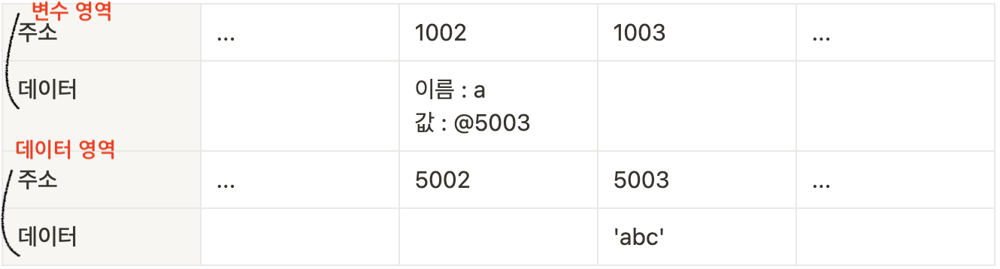
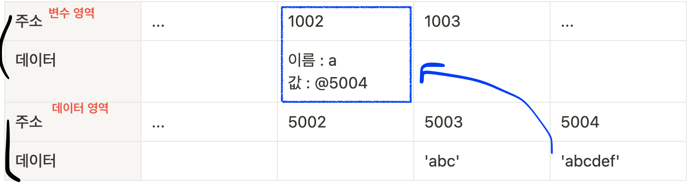
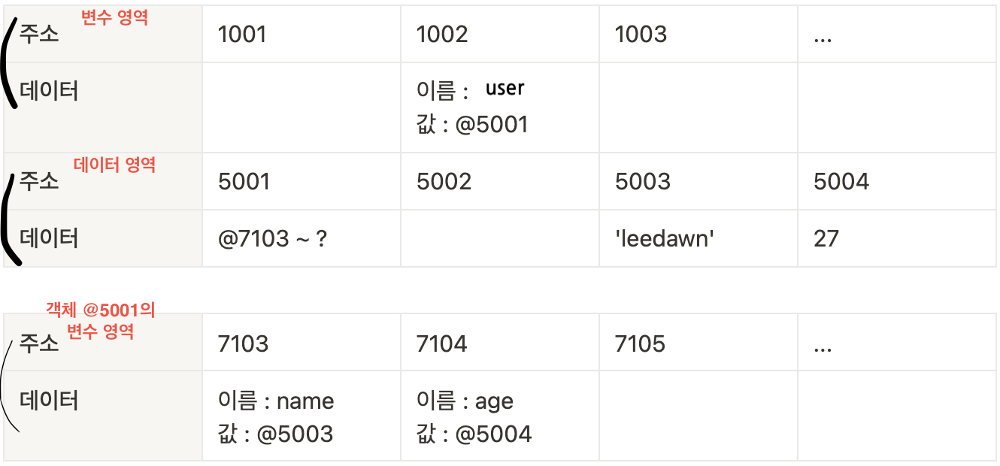

# 코어 자바스크립트 🐯

## 🔧 데이터 타입

### 1. 데이터 타입의 종류

자바스크립트의 데이터 타입

- 기본형(원시형, primitive type)
- 참조형(referance type)

기본형에는 숫자(number), 문자열(string), 불리언(boolean), null, undefined 등이 있으며, ES6에서 심볼(symbol)이 추가됐습니다.

참조형에는 객체(object)가 있고, 배열(array), 함수(function), 날짜(Date), 정규표현식(RegExp) 등과 ES6에서 추가된 Map, WeakMap, Set, WeakSet 등이 객체의 하위 분류에 속합니다.

**어떤 기준으로 기본형과 참조형을 분류하는 것일까요?**
일반적으로 기본형은 할당이나 연산 시 복제되고 참조형은 참조된다고 알려져 있습니다. 엄밀히 말하면 둘 모두 복제를 하긴 합니다. 다만 기본형은 값이 담긴 주소값을 바로 복제하는 반면, 참조형은 주솟값으로 이루어진 묶음을 가리키는 주소값을 복제하는 점이 다릅니다.

### 2. 데이터 타입에 관한 배경지식

#### 1-2-1 메모리와 데이터

0 또는 1만 표현할 수 있는 하나의 메모리 조각을 비트(bit)라고 합니다. 메모리는 매우 많은 비트들로 구성되어 있는데, 각 비트는 고유한 식별자(unique identifier)를 통해 위치를 확인 할 수 있습니다. 그런데 고작 0이나 1만 표현할 수 있는 비트 단위로 위치를 확인하는 것은 매우 비효율적입니다. 그보다는 몇 개씩 묶어 하나의 단위로 여긴다면 표현할 수 있는 값도 늘어나면서 동시에 검색 시간을 줄일 수도 있을 겁니다.

한편 매우 많은 비트를 한 단위로 묶으면 이번에는 검색 시간을 줄일 수도 있고 표현할 수도 있는 데이터의 개수도 늘어나겠지만 동시에 낭비되는 비트가 생기기도 합니다. 자주 사용하지 않을 데이터를 표현하기 위해 빈 공간을 남겨놓기보다는 표현 가능한 개수에 어느정도 제약이 따르더라도 크게 문제가 되지 않을 적정한 공간을 묶는 편이 낫습니다. 이런 고민의 결과로 바이트(byte)라는 단위가 생겼습니다.

c/c++, java와 같은 정적 타입 언어는 메모리의 낭비를 최소화하기 위해 데이터 타입별로 할당할 메모리 영역을 2바이트, 4바이트 등으로 나누어 정해 놓았습니다. 예를 들어, 2바이트 크기의 정수형 타입(short)은 0을 포함해 -32768 ~ +32767의 숫자만 허용합니다. 만약 사용자가 +32768 또는 그 이상의 숫자를 입력하면 오류가 나거나 잘못된 값이 저장되고 맙니다. 이 문제를 해결하기 위해서는 사용자가 직접 4바이트 크기의 정수형 타입(int) 등으로 형변환 해야합니다.

한편 메모리 용량이 과거보다 월등히 커진 상황에서 등장한 자바스크립는 상대적으로 메모리 관리에 대한 압박에서 자유로워졌습니다. 그래서 메모리 공간을 좀 더 넉넉하게 할당했습니다. 숫자의 경우 정수형인지 부동소수형인지를 구분하지 않고 64비트, 즉 8바이트를 확보합니다. 덕분에 개발자가 위와 같은 형변환을 걱정 해야하는 상황이 훨씬 덜 발생하게 되었습니다.

우리는 지금 컴퓨터에서 숫자형 데이터를 저장하는 방법을 개념적으로 알아보고 있습니다. 앞서 각 비트는 고유한 식별자를 지닌다고 했었죠. 바이트 역시 시작하는 비트의 식별자로 위치를 파악할 수 있을 것입니다. 모든 데이터는 바이트 단위의 식별자, 더 정확하게는 **메모리 주솟값**을 통해 서로 구분하고 연결할 수 있습니다.

#### 1-2-2 식별자와 변수

**변수**는 '변할 수 있는 수'입니다. 영어단어 variable은 원래 '변할 수 있다'라는 형용사이지만 컴퓨터 용어로 쓸 때는 '**변할 수 있는 무언가**'라는 명사로 확장시켰습니다. 여기서 무언가란 **데이터**를 말합니다. 숫자도 데이터이고, 문자열, 객체, 배열 모두 데이터입니다. **식별자**는 어떤 데이터를 식별하는 데 사용하는 이름, 즉 **변수명**입니다.

### 3. 변수 선언과 데이터 할당

#### 1-3-1 변수 선언

```javascript
const a;
```

위의 예제와 같은 명령을 받은 컴퓨터는 메모리에서 비어있는 공간(여기선 임의로 1003번)을 하나를 확보합니다. 이 공간의 이름(식별자)을 a라고 지정합니다. 여기까지가 변수 선언 과정입니다. 이후에 사용자가 a에 접근하고자 하면 컴퓨터는 메모리에서 a라는 이름을 가진 주소를 검색해 해당 공간에 담긴 데이터를 반환할 것 입니다.


#### 1-3-2 데이터 할당

```javascript
const a = 'abc'
```

선언과 할당을 두 문장으로 나누어 명령하든 한 번에 명령하든 자바스크립트 엔진은 결국 똑같은 동작을 수행합니다.
위의 코드를 할당했을 때의 전체적인 흐름은 다음과 같습니다.



1. 변수 영역에서 빈 공간을(@1002)을 확보한다.
2. 확보한 공간에서 식별자를 a로 지정한다.
3. 데이터 영역의 빈 공간(@5004)을 문자열 'abc'를 저장한다.
4. 변수 영역에서 a라는 식별자를 검색한다(@1003).
5. 앞서 저장한 문자열의 주소(@5004)를 @1003의 공간에 대입한다.

**변수 영역에 값을 직접 대입하지 않고 번거롭게 한 단계를 더 거치는 이유는?**

- 이는 데이터 변환을 자유롭게 할 수 있게 함과 동시에 메모리 관리를 더욱 효율적으로 하기 위함입니다.



문자열 'abc'의 마지막에 'def'를 추가하라는 명령을 하면, 컴퓨터는 앞서 'abc'가 저장된 공간에 'abcdef'를 할당하는 대신 'abcdef'라는 문자열을 새로 만들어 별도의 공간에 저장하고, 그 주소를 변수 공간에 연결합니다. 기존 문자열에 어떤 변화를 주던 새로운 공간을 만들어 할당합니다.

다른 예로 500개의 변수에 숫자 5를 할당한다고 했을 때, 각 변수 공간마다 매번 숫자 5를 할당하려고 한다면 숫자형은 8바이트가 필요하다고 했으니까 500 \* 8 = 4000바이트를 써야할 것입니다. 그 대신 5를 별도의 공간에 한 번만 저장하고 해당 주소만 입력한다면, 500 \* 2 + 8 = 1008바이트만 이용하면 더 효율적이겠죠? 이처럼 변수 영역과 데이터 영역을 분리하면 중복된 데이터에 대한 효율이 높아집니다.

### 4. 기본형 데이터와 참조형 데이터

#### 1-4-1 불변값

변수(variable)와 상수(constant)를 구분짓는 기준은 '변경 가능성'입니다. 불변값과 상수를 같은 개념으로 오해하기 쉬운데 이 둘을 명확하게 구분 지어야합니다. 변수와 상수를 구분 짓는 변경 가능성의 대상은 **변수 영역** 메모리입니다. 한 번 데이터 할당이 이루어진 변수 공간에 다른 데이터를 재할당할 수 있는지 여부가 관건입니다.

기본형 데이터인 숫자, 문자열, boolean, undefined, null, Symbol은 모두 불변값입니다.

**한번 만든 데이터 값은 다른 값으로 변경할 수 없습니다. 변경은 새로 만드는 동작을 통해서만 이뤄집니다. 이것이 바로 불변성의 성질입니다. 한 번 만들어진 값은 가비지 컬렉팅을 당하지 않는 이상 영원히 변하지 않습니다.**

#### 1-4-2 가변값

```javascript
const user = {
	name: 'leedawn',
	age: 27,
}
```



1. 컴퓨터는 우선 변수 영역의 빈 공간(@1002)을 확보하고, 그 주소의 이름을 user로 지정합니다.
2. 임의의 데이터 공간(@5001)에 데이터를 저장하려고 보니 여러 개의 프로퍼티로 이루어진 데이터 그룹입니다. 이 그룹 내부의 프로퍼티를 저장하기 위해 별도의 변수 영역을 마련하고, 그 영역의 주소(@7103 ~ ?)를 @5001에 저장합니다.
3. @7103 및 @7104에 각각 name과 age라는 프로퍼티 이름을 지정합니다.
4. 데이터 영역에서 'leedawn'을 검색합니다. 검색 결과가 없으므로 임의로 @5003에 저장하고, 이 주소를 @7103에 저장합니다. 숫자 27 역시 임의로 @5004에 저장하고, 이 주소를 @7104에 저장합니다.

기본형 데이터와의 차이는 '객체의 변수(프로퍼티) 영역'이 별도로 존재한다는 점입니다.
